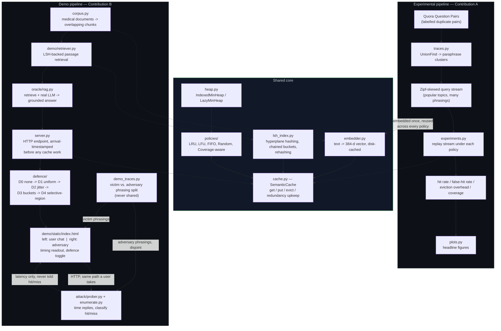

# CacheProbe

Coverage-aware eviction and timing-channel defence for semantic LLM caches.

A semantic cache stores query embeddings alongside their responses, and serves
a cached answer whenever an incoming query lands within a similarity threshold
of one already stored — so a paraphrase of an earlier question can hit the
cache even though the exact words never repeat. This project builds one from
scratch and studies two problems that come with it: which entry to evict when
the cache is full (**Contribution A**), and how much a cache hit's speed gives
away about what other users have asked (**Contribution B**).

## Workflow

Two pipelines share one core. The **experimental** pipeline (left) answers "is
the eviction policy any good," replayed offline against a mocked backend so
every run is free and reproducible. The **demo** pipeline (right) is a live,
working medical chatbot that shows the timing leak — and the defence closing
it — in front of an audience.



**Reading the diagram:** everything in the demo pipeline that touches `RAG` or
`oracle/rag.py` calls a real LLM; everything in the experimental pipeline runs
against `oracle/mock.py` — a fixed sleep, no network, no spend — so the two
never contaminate each other's numbers. The attacker (bottom right) only ever
measures reply latency over the same HTTP path a real user would use; it is
never told whether a reply was a cache hit, which is what makes the leak (and
each defence closing it) real rather than assumed.

## Module map

- `embedder.py`, `lsh_index.py`, `heap.py`, `cache.py` — the semantic cache
  core: embed, index, evict, serve
- `policies/` — eviction policies: `lru.py`, `lfu.py`, `fifo.py`, `random.py`,
  and `coverage.py` (Contribution A)
- `defence/` — latency-shaping defences against the timing side channel:
  `uniform.py` (D1), `jitter.py` (D2), `quantised.py` (D3), `selective.py` (D4),
  plus `regions.py` (offline sensitivity partition) and `scheduler.py`
  (deadline-based release)
- `attack/` — the adversary: `prober.py` (timing client), `enumerate.py`
  (Procedure 1 — membership), `reconstruct.py` (Procedure 2 — boundary search),
  `monitor.py` (Procedure 3 — temporal), `leakage_graph.py` (attack-independent
  bound)
- `oracle/` — the backend behind the cache: `mock.py` (fixed sleep) for every
  experiment, `rag.py` (retrieve + real LLM) for the demo only
- `server.py` — HTTP endpoint wrapping the cache
- `traces.py`, `experiments.py`, `plots.py` — the experimental pipeline
- `corpus.py`, `demo_traces.py`, `demo/` — the demo pipeline

## Two data pipelines

**Experimental (Quora Question Pairs).** `traces.py` builds paraphrase clusters
from labelled duplicate pairs and samples a Zipf-skewed query stream. Labelled
duplicates are what make false-hit rate measurable, so this pipeline is the one
every reported result comes from, always against `oracle/mock.py`.

**Demo (medical).** `corpus.py` loads and chunks a fixed medical corpus for RAG
retrieval; `demo_traces.py` groups medical questions by topic and splits each
topic's phrasings into victim and adversary sets. `demo/` serves the two-pane
interface — user chat on the left, adversary timing readout on the right, with a
toggle across the four defences.

The victim/adversary phrasing split is not optional: if the adversary probes with
a string the victim used, the demo tests exact matching and demonstrates nothing
about the semantic claim.

Retrieval quality is not evaluated — no recall@k, no chunking ablation. The
generation pipeline is infrastructure, not an object of study.

**Known limitation.** Cached answers go stale if a source document changes: the
cache holds no dependency link to its inputs. Document-dependency invalidation is
future work.

## Status

AI-free (data structures, algorithms, and plain HTTP/JSON) unless noted:

| Area | Status |
|---|---|
| `heap.py`, `lsh_index.py`, `cache.py`, `policies/` | done, AI-free |
| `defence/`, `attack/`, `server.py`, `experiments.py`, `plots.py` | done, AI-free |
| `corpus.py`, `demo_traces.py`, `demo/retriever.py`, `demo/app.py` | done, AI-free (consume embeddings, don't produce them) |
| `embedder.py` | needs repair — see below |
| `oracle/rag.py` | not yet implemented — the only file that calls a real LLM |
| `defence/regions.py` zero-shot labelling | not implemented by design — the keyword and operator-policy labellers are AI-free and implemented instead |

`embedder.py` currently has hand-edit typos (`text.encoder` instead of
`.encode`, `self.vecs` instead of `self._vecs`, `json.dump` instead of
`json.dumps`, and `save()` is missing its `np.save` call). Nothing runs against
real embeddings until it's fixed.

## Setup

```bash
pip install sentence-transformers fastapi uvicorn pytest
```

`numpy`, `matplotlib`, `requests`, `torch`, `transformers`, `pydantic` are
assumed already available in the environment.
